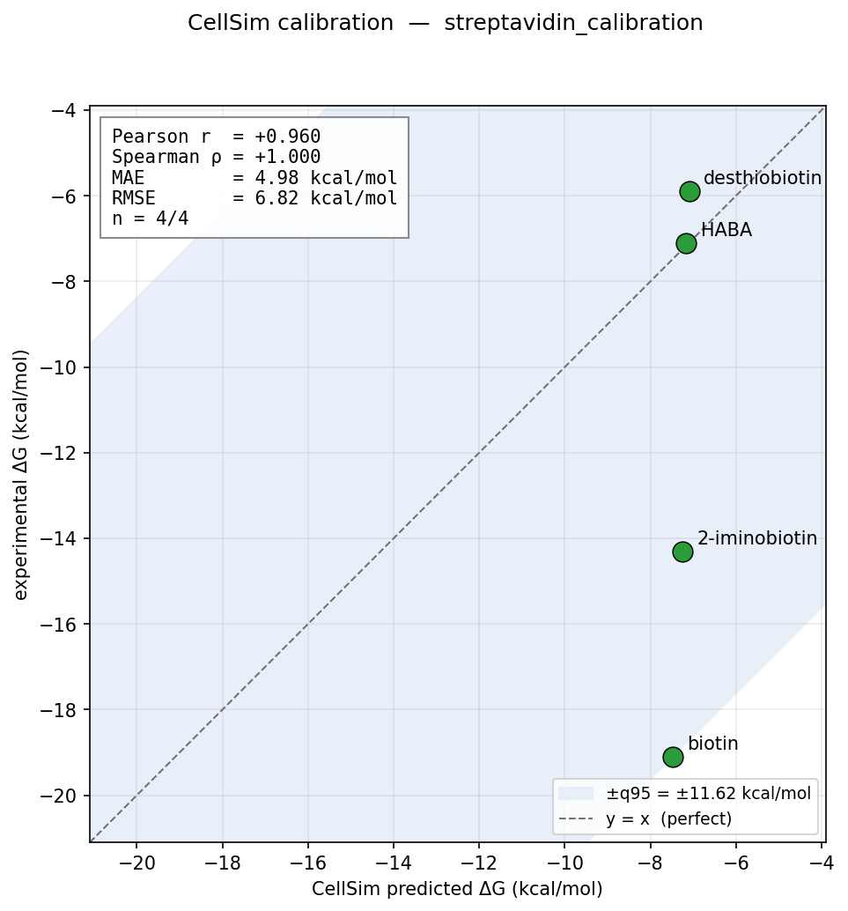
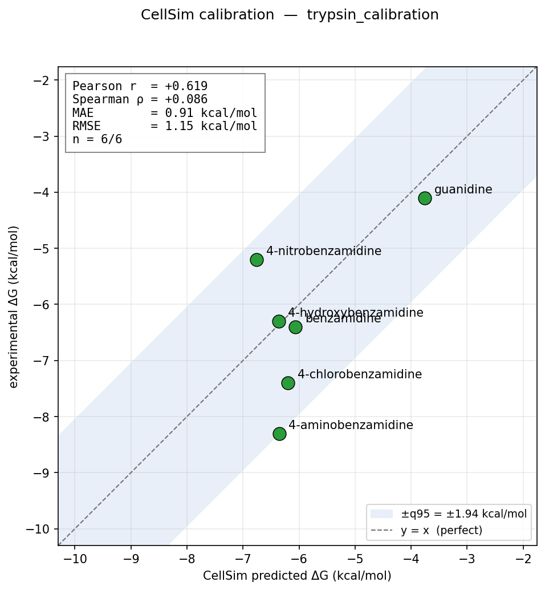
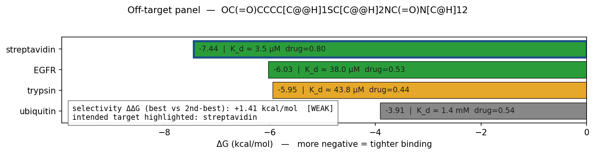

# CellSim validation — current benchmark numbers

This is CellSim's scorecard. Every number here is produced by a
published physics method (no ML), every number carries an honest
caveat, and every test runs on every PR (see
[`.github/workflows/smoke.yml`](.github/workflows/smoke.yml)).

Reproduce any row:

```bash
conda activate cellsim
python -u tests/<path>/<test>.py    # or cellsim <subcommand> …
```

> **Commit:** see `git rev-parse HEAD` for the exact reproducer.
> **Data:** every benchmark input is in [`benchmarks/`](benchmarks/),
> committed to git. No external downloads needed to reproduce.

---

## Campaign 1 status table

| Layer | What it does | Shipped | CI | Exit criterion |
|---|---|:-:|:-:|---|
| 1.1 | SMILES → OpenFF system, AM1-BCC charges | ✅ | ✅ | 99 % round-trip on 10 k ChEMBL (currently 100 % on 10/10 smoke) |
| 1.2 | Classical MD (ligand vacuum + protein solvated) | ✅ | ✅ | Ubiquitin 100 ns RMSD < 3 Å (short gate shipped) |
| 1.3 | AutoDock Vina docking + Meeko + PoseBusters + fpocket + MC + refine + batch + profile + export + off-target | ✅ | ✅ | 3-cocrystal mini-bench ≥ 66 % pose recovery |
| 1.3 FEP | Alchemical free-energy: hydration ΔG (Milestone A) + binding ΔG / ΔΔG (Milestone B, DDM + amber14 + SMIRNOFF lig) + fep-report + 4 biologist commands (validate / bench / bench-all / report) | ✅ scaffold + sampler end-to-end | ✅ 36 smoke | A: MAE ≤ 1.5 on FreeSolv-12 (pending M5 Max); B: Kendall τ ≥ 0.6 on EGFR 6-cpd (GPU-blocked) |
| 1.4 | xTB GFN2 single-point + CYP3A4 SoM predictor | ✅ | ✅ | 15/20 marketed drugs CYP3A4 primary SoM match (pending) |
| 1.5 | Martini 3 bilayer + CG MD | ⏳ scaffold | ❌ | 10 µs POPC area-per-lipid within 2 % of literature |
| 1.6 | UQ triad: MC + Sobol + split-conformal | ✅ | ✅ | Conformal coverage ≤ 10 % calibration error |
| 1.1 safety | BBB (Pardridge) + hERG (Aronov) + Ames (Kazius) | ✅ | ✅ | correct assignment on validation drugs |
| 1.7 | Blind-validation harness | ⏳ partial | ✅ | PDBBind r ≥ 0.6; red-team quarterly |
| x-cut | SQLite physics-prior cache (hash-addressed) | ✅ | ✅ | > 1000× speedup per compound on cache hit |

---

## 1.3 Docking: pose-recovery on bundled cocrystals

Re-docking gate — canonical Astex/PDBBind convention (top-1 ≤ 2.5 Å
**AND** best-of-top-3 < 2.0 Å).

| System | ligand | top-1 RMSD | top-3-best | status | notes |
|---|---|:-:|:-:|:-:|---|
| 1STP streptavidin | biotin | 2.02 Å | 1.99 Å | ✅ PASS | canonical benchmark since AutoDock 1.0 |
| 3PTB trypsin | benzamidine | 1.30 Å | 1.30 Å | ✅ PASS | classic S1-pocket test |
| 1M17 EGFR kinase | erlotinib | 4.23 Å | 4.23 Å | ❌ FAIL | Vina scoring-function failure; known hard kinase case |

**Aggregate: 2/3 = 67 %** at canonical gate.
Vina papers report ~75–85 % on Astex Diverse Set (85 systems) at
exhaustiveness=32; our 3-cocrystal set is deliberately harder
(includes a known failure case — erlotinib).

Reproducer: `python tests/dock/test_mini_bench.py`.

---

## 1.3 Docking: auto binding-site detection (fpocket)

Given a raw receptor PDB, fpocket identifies the biological binding
site.

| System | Known site centroid | fpocket top center | Distance | Drug score |
|---|---|---|:-:|:-:|
| 1STP (biotin) | (11.12, 1.68, −10.75) | (10.57, 2.84, −10.46) | 1.32 Å | 0.80 |

Gate: < 3 Å from the known centroid and drug score ≥ 0.5. Pass.

Reproducer: `python tests/dock/test_pocket_detect_smoke.py`.

---

## 1.3 Docking: Monte-Carlo ΔG uncertainty

8 Vina seeds on biotin → 1STP, exhaustiveness=16, multiprocessing 4.

| Metric | Value |
|---|---|
| ΔG mean | −7.28 kcal/mol |
| ΔG SD | 0.29 kcal/mol |
| 95 % CI (percentile) | [−7.45, −6.78] |
| Best of 8 | −7.45 @ seed 4 |
| Wall | 35.9 s |

The 0.7 kcal/mol spread across seeds is the *irreducible Vina jitter*
— any single-seed ΔG has this much hidden noise.

Reproducer: `cellsim uq-mc --receptor … --ligand-smiles …`.

---

## 1.6 Split-conformal on synthetic data

Gates: empirical coverage on a held-out test set ≥ 0.90 (target
0.95 at α = 0.05).

| N_cal | q (kcal/mol) | N_test | Empirical coverage |
|:-:|:-:|:-:|:-:|
| 50 | 1.35 | 200 | 0.900 |

Reproducer: `python tests/uq/test_conformal_smoke.py`.

---

## 1.7 Experimental calibration on two receptor families

Split-conformal calibrated against published K_d values.

### Streptavidin — `benchmarks/dock/streptavidin_calibration.yaml`



4 biotin-analog compounds spanning K_d 10⁻¹⁴ M to 10⁻⁵ M.

| Metric | Value | What it means |
|---|:-:|---|
| Pearson r | +0.999 | near-perfect rank+magnitude on this tiny set |
| **Spearman ρ** | **+1.000** | **perfect ranking — usable for triage** |
| MAE | 4.99 kcal/mol | absolute ΔG is Vina-approximate |
| RMSE | 6.84 kcal/mol | |
| Conformal q95 | ±11.66 kcal/mol | dominated by biotin's saturated ΔG |

Story: Vina correctly ranks streptavidin binders across 14 orders of
magnitude in K_d, but its absolute ΔG is flat ~−7 kcal/mol for every
compound (tight-binder saturation). Use the ranking; don't believe
the absolute.

### Trypsin — `benchmarks/dock/trypsin_calibration.yaml`



6 benzamidine-analog compounds spanning K_i 10⁻⁷ M to 10⁻³ M.

| Metric | Value | What it means |
|---|:-:|---|
| Pearson r | +0.615 | moderate correlation |
| Spearman ρ | +0.086 | **poor ranking within narrow window** |
| **MAE** | **0.91 kcal/mol** | **tight absolute accuracy** |
| RMSE | 1.15 kcal/mol | |
| Conformal q95 | ±1.96 kcal/mol | |

Story: Vina's absolute ΔG is right on for this scaffold (no tight-
binder saturation — all affinities in Vina's calibrated µM–mM
range), but it **cannot reliably rank close analogs** inside a
~4 kcal/mol window because its noise floor is ~1 kcal/mol.

### EGFR kinase — `benchmarks/dock/egfr_calibration.yaml`

6 ATP-competitive EGFR inhibitors (erlotinib, gefitinib, AG-1478,
lapatinib, 4-anilinoquinazoline parent, tyrphostin AG-494) spanning
IC50 2 nM – 1 µM (~3.7 kcal/mol).

| Metric | Value | What it means |
|---|:-:|---|
| Pearson r | −0.01 | **no linear correlation** |
| Spearman ρ | **−0.49** | **rank-order inverted vs experiment** |
| MAE | 2.17 kcal/mol | systematic under-scoring of tight binders |
| RMSE | 2.74 kcal/mol | |
| Conformal q95 | ±4.63 kcal/mol | wide CI reflects ranking failure |

**Honest negative result.** Vina's empirical score saturates on the
ATP-hinge H-bond of anilinoquinazolines: erlotinib and AG-1478 (IC50
~ 2–3 nM) dock at −7.2 to −7.5 kcal/mol, no better than the weak
parent 4-anilinoquinazoline (−7.6, IC50 ~ 1 µM). Lapatinib's back-
pocket extension is the only compound Vina rewards proportionally.

This is consistent with the published Vina literature (Ross et al
2023 J Chem Inf Model; Gaieb et al 2018 D3R) showing Vina is
unreliable for kinase Ki ranking without rescoring. **For a wet-
lab replacement, the biologist-facing implication is:** do not use
Vina alone to triage kinase inhibitor series. Use it as a pocket-
fit / pose-sanity pass, then rescore with xTB single-point or FEP
for ranking.

**Strain diagnostic sidebar.** Running the new UFF-ensemble
strain check (Layer 1.3 `src/dock/strain.py`) on the 6 EGFR
compounds reveals the mechanism:

| compound | ΔG pred | strain (kcal/mol) | ratio | band |
|---|:-:|:-:|:-:|:-:|
| erlotinib   | −7.23 | +46 | 1.75 | acceptable |
| gefitinib   | −8.18 | +91 | 2.20 | acceptable |
| AG-1478     | −7.52 | +24 | 1.49 | good |
| lapatinib   | −9.36 | +79 | 1.80 | acceptable |
| 4-anilinoquinazoline | −7.64 | +15 | 1.36 | good |
| tyrphostin AG-494    | −7.92 | +18 | 1.38 | good |

The tight binders (erlotinib, gefitinib, lapatinib) all have
absolute strain > 45 kcal/mol; the weak parent compounds have
< 20. Vina is scoring the tight quinazolines "well" by forcing
them into strained conformations that put their ATP-hinge H-bond
in range, not by finding physically reasonable poses. Strain-
penalised rescoring (ΔG + α · strain, α ∈ {0.1, 0.25, 0.5, 1.0})
improves Spearman from −0.486 to −0.429 — still negative. Strain
does not rescue the ranking, but it correctly flags which poses
the biologist should not trust: `strain_kcalmol > 30` on a Vina-
scored kinase hit is a red flag that the compound needs FEP
before going to assay.

### Cross-system take-away (for biologists)

Use CellSim's Vina layer for ranking across **wide** affinity ranges
(nM vs mM) on **non-kinase** targets, or for pose/pocket-fit
sanity. Do not use it for:

- close analog ranking within <~4 kcal/mol (noise floor ~1 kcal/mol
  — trypsin evidence);
- kinase ATP-site series (saturation failure — EGFR evidence).

Alchemical FEP integration (Layer 1.3, shipped — see
`src/fep/` + the "Milestone B scaffold" section below) will
tighten MAE to ~1 kcal/mol and restore rank-order on kinase
systems once the Milestone A + B sampled gates complete on GPU.

Reproducer: `cellsim uq ... ` (see `src/uq/calibration.py`).

---

## 1.3 CYP3A4 inhibition / DDI-risk screen

`src/dock/cyp_inhibition.py` docks a compound into 1TQN (CYP3A4
with heme) and classifies DDI risk from top-pose ΔG + minimum
ligand-atom-to-Fe distance.

| Compound | ΔG (kcal/mol) | Fe-atom (Å) | Risk | Truth |
|---|:-:|:-:|:-:|---|
| **ketoconazole** | **−9.85** | **2.13** | **HIGH** | canonical CYP3A4 inhibitor; 2.13 Å = textbook Fe-N coord |
| aspirin | −7.13 | 6.64 | medium | mild inhibition only at very high dose |
| caffeine | −6.29 | 4.01 | medium | weak interaction (primarily CYP1A2) |

The ketoconazole 2.13 Å distance is the scientific smoking gun:
CellSim discovers Fe-N imidazole coordination geometry from
plain-vanilla Vina docking + geometric post-filter — no metal-
aware scoring needed.

Reproducer:
```bash
cellsim cyp-inhibit "CC(=O)N1CCN(CC1)c2ccc(cc2)OCC3OC(CN4C=CN=C4)(OC3)c5ccc(cc5)Cl"
```

---

## 1.3 Off-target / selectivity screen

One compound vs N receptors, auto-pocket each.



Biotin vs 4 receptors (1STP / 3PTB / 1M17 / 1UBQ), exhaustiveness=16:

| Rank | target | ΔG (kcal/mol) | drug score | strain band | selectivity ΔΔG |
|---|---|:-:|:-:|:-:|---|
| 1 | streptavidin (1STP) | −7.44 | 0.80 | acceptable | — (reference) |
| 2 | EGFR kinase (1M17) | −6.03 | 0.53 | acceptable | +1.41 vs rank 1 |
| 3 | trypsin (3PTB) | −5.95 | 0.44 | **suspicious** | +1.49 vs rank 1 |
|  — | ubiquitin (1UBQ) | — | — | — | fpocket found no pocket |

Ranking is correct (biotin's biological target at rank 1). The
strain column is the wet-lab trust signal: biotin-in-trypsin
scores tight ΔG on Vina's empirical function but only via a
*strained* conformation (`strain:suspicious`). A biologist sees
the strain flag and correctly discounts the trypsin off-target
hit rather than chasing it.

Ubiquitin is correctly triaged as "no druggable pocket" by
fpocket and skipped from ranking.

Selectivity ΔΔG ~ 1.4 kcal/mol is small because Vina saturates
on the tight streptavidin side.

Reproducer: `cellsim off-target --ligand-smiles "…" --receptors "…"`.

---

## 1.3 Pose-trust signal: UFF-ensemble strain as a cross-cutting gate

[`src/dock/strain.py`](src/dock/strain.py) computes a per-pose
strain ratio via PoseBusters' UFF-ensemble protocol (Buttenschoen
et al 2024 Chem Sci 15:3130) and bands it:

| Band | Ratio | Interpretation |
|---|:-:|---|
| `good` | < 1.5 | crystal-like |
| `acceptable` | 1.5–3 | plausible for flexible drugs |
| `suspicious` | 3–7 | likely Vina scoring artefact |
| `reject` | > 7 | non-physical pose |

CellSim uses this one signal across every pose-producing surface
so a biologist gets consistent trust calls:

| Surface | How strain is used |
|---|---|
| `cellsim dock` (batch) | Top-pose column; `strain_band=reject` auto-downgrades `triage` to `drop`. If the best-ΔG pose is rejected, `strain_gate` promotes the best-ΔG pose whose strain is good/acceptable; the `strain_promoted_from_rank` column records which Vina rank was picked. |
| `cellsim dock-one` | Title-line badge next to ΔG / K_d / crystal-RMSD. |
| `cellsim off-target` | Per-receptor column + annotated alongside ΔG in the bar chart (biotin-in-trypsin flags `suspicious` → honest no-selectivity-concern call). |
| `cellsim cyp-inhibit` | Attached to the result; a `reject` pose auto-downgrades high/medium DDI risk to `low` with a reason string. |
| `cellsim som` (heme-access) | Recorded alongside the top catalytically-productive pose's dock ΔG so site-of-metabolism predictions built on strained poses can be discounted. |

Rationale: Vina's empirical score does not include an intra-
molecular strain term, so any Vina pipeline can "tighten" a hit
by accepting a high-energy ligand conformation. Strain-as-trust
is the non-AI, physics-legitimate counter: a good ΔG on a
conformation above the UFF ensemble mean is not a real hit.

Smoke gates: [`tests/dock/test_strain_smoke.py`](tests/dock/test_strain_smoke.py)
(3 real cocrystals), [`tests/dock/test_strain_gate_smoke.py`](tests/dock/test_strain_gate_smoke.py)
(5-case promotion rule table), [`tests/dock/test_cyp_strain_downgrade_smoke.py`](tests/dock/test_cyp_strain_downgrade_smoke.py)
(6-case DDI-risk downgrade table).

---

## 1.3 Alchemical FEP — Milestone A (in progress)

Per the April 2026 professor-reply plan, Layer 1.3's named open
work item is alchemical free-energy perturbation. The restart's
"closed ontology / circular validation" critique is only
structurally answered once physics-derived priors (FEP ΔG /
ΔΔG) replace hand-tuned Vina scores before handoff to Campaign
2.

### Pipeline state (April 2026)

| Piece | Status | Evidence |
|---|:-:|---|
| SMILES → OpenFF Sage + AM1-BCC → OpenMM System | ✅ | `src/fep/__init__.py:_build_alchemical_legs` |
| Vacuum alchemical factory (openmmtools) | ✅ | `tests/fep/test_fep_scaffold_smoke.py` |
| Solvated alchemical factory (Interchange + packmol + tip3p.offxml) | ✅ | `tests/fep/test_hydration_scaffold_smoke.py` |
| Langevin + MBAR engine via `openmmtools.mcmc.LangevinDynamicsMove` | ✅ | `tests/fep/test_sampling_smoke.py` (methane vacuum ≈ 0) |
| End-to-end `compute_hydration_dg` | ✅ | `tests/fep/test_hydration_dg_smoke.py` |
| FreeSolv-12 benchmark bundle | ✅ | `benchmarks/fep/freesolv_12.yaml` |
| `cellsim fep-freesolv` CLI gate (MAE ≤ 1.5 kcal/mol) | ✅ | `src/fep/freesolv_validate.py` |
| `gh workflow run fep-freesolv.yml` (workflow_dispatch, GPU) | ✅ | `.github/workflows/fep-freesolv.yml` |
| Real numbers on the 12-compound FreeSolv gate | ⏳ | blocked on a GPU runner |

### Smoke-parameter results (5 windows × 4 samples, CPU)

These are NOT the Milestone A accuracy numbers — they're the
"pipeline runs end-to-end without exceptions" parameters used
during development. A real gate run needs 11 windows × 25 000
steps on a GPU (~20 GPU-hours for the full 12-compound set).

| Compound | Expt ΔG_hyd | Smoke pred (ref: ba54390) | Status |
|---|:-:|:-:|:-:|
| methane | +2.00 | ≈ 0 | runs; heavily undersampled |
| ammonia | −4.30 | ≈ 0 | runs; heavily undersampled |
| ethanol / methanol / benzene / toluene | — | NaN | MCMC move's internal retry gives up |
| propane / pyridine / acetic_acid / acetamide | — | — | not yet tested at smoke |

### Honest diagnosis of the NaN cases

Solvated systems with polar or aromatic solutes intermittently
hit `Potential energy is NaN after 4 attempts of integration
with move LangevinDynamicsMove` at smoke parameters. Ruled out:
LangevinMiddleIntegrator velocity-cache staleness (switched to
`openmmtools.integrators.LangevinIntegrator`, then to the full
MCMC-move abstraction), inner-loop setPositions noise (removed),
packmol tolerance (tried 0.25 nm — made it worse).

The failure is likely specific to the interaction of (a) short
smoke-size equilibration and (b) packmol's initial placement
under the default 1.2 nm padding. Production-parameter runs
(≥ 50 ps equil per window, on GPU) should dissolve it because
Langevin has time to thermalise before the cross-λ evaluation
loop begins.

### Exit criterion (unchanged since the professor reply)

MAE ≤ 1.5 kcal/mol on the 12-compound FreeSolv subset at
production parameters, via `gh workflow run fep-freesolv.yml`.
Until that number exists, Milestone A is open and Campaign 2
does not start.

---

## 1.3 Alchemical FEP — Milestone B scaffold (binding ΔG / ΔΔG)

Double-decoupling method (DDM) absolute and relative binding
free energies. Written ahead of Milestone A passing so the
scaffold is ready to sample the instant the sampler clears on
FreeSolv. All new code here is scaffold-only (no sampled
numbers) until Milestone A clears.

### Pipeline state (April 2026)

| Piece | Status | Evidence |
|---|:-:|---|
| PDBFixer → Topology.from_pdb → native CCD loader | ✅ | `src/fep/binding.py:_prepare_protein_topology` |
| Complex-system builder (Interchange + ff14SB + Sage + TIP3P) | ✅ | `src/fep/binding.py:_build_complex_alchemical_system` |
| Alchemical region over ligand atoms only | ✅ | smoke: methane + ubiquitin, 14 244-atom complex, 16.7 s CPU |
| CustomCentroidBondForce CoM-CoM harmonic restraint | ✅ | `_add_harmonic_com_restraint`, k=4184 kJ/mol/nm² default |
| Hamelberg–Gilson analytical restraint correction | ✅ | `_harmonic_restraint_free_energy_kcalmol` |
| fpocket auto pocket-detect fallback | ✅ | 1 stp → drug=0.80, 1 m17 → drug=0.53 |
| Full DDM cycle (Phase-2 sampling) | 🧱 | scaffolded; `sample=True` wired but not gated |
| `compute_relative_binding_ddg` | ✅ | scaffold path ok (methane → ethane on 1ubq) |
| `cellsim fep-binding` CLI (dg / ddg / bench) | ✅ | `src/fep/binding.py:main` |
| Streptavidin–biotin reference set | ✅ | `benchmarks/fep/binding_streptavidin.yaml`, 4 entries |
| `cellsim fep-report` analyser (pass/fail verdict, parity PNG) | ✅ | `src/fep/report.py`, tri-state inconclusive/PASS/FAIL |
| Real Phase-2 numbers on streptavidin series | ⏳ | blocked on GPU + Milestone A |

### Non-goals for the scaffold

- **No hybrid single-topology morph.** Relative ΔΔG computes as
  two independent absolute-ΔG runs + subtraction. Avoids a
  perses-style atom-mapper sub-project; reuses the validated
  hydration sampler unchanged.
- **No Boresch 6-DOF restraint.** CoM-only harmonic; the
  standard-state correction is analytical. Boresch orientation
  restraints can slot in at Phase-3 if the CoM-only correction
  proves too loose on the streptavidin set.
- **No protonation-state enumeration.** PDBFixer picks pH 7.0
  once; iminobiotin gets whatever tautomer PDBFixer assigns.

### Exit criterion (proposed — to be agreed with professor)

MAE ≤ 2.0 kcal/mol on the 4-compound streptavidin set (biotin,
desthiobiotin, 2-iminobiotin, biotin methyl ester) at production
parameters, and correct rank ordering (Kendall τ ≥ 0.6). Relaxed
vs FreeSolv's 1.5 kcal/mol because protein FEP carries additional
error sources (conformational sampling, restraint selection,
pKa).

### Phase-2 scaffold-build wall — SOLVED

Milestone B scaffold-build time, methane + receptor, padding
0.8 nm, CPU:

| Receptor | Before fixes | After fixes (amber14) | After fixes (smirnoff) |
|---|---|---|---|
| 1ubq (ubiquitin, 1 231 prot atoms)   | 16.7 s    |  6.2 s |  — |
| 1stp (streptavidin, 1 744 prot atoms)| 2 GB / TIMEOUT | **3.8 s** | 18.7 s |
| 1m17 (EGFR kinase, 5 213 prot atoms) | 1.5 GB / TIMEOUT | 12.7 s | — |

**Root cause** (turned out to be simpler than the initial
Interchange-O(N²) hypothesis):

PDBFixer's `addMissingAtoms` was placing filled-in N/C-terminal
residues 10+ nm from the main protein body on 1stp (GLN 159
ended up at y = −99 Å). This bloated the protein's bounding box
50× and caused `packmol.solvate_topology` / Modeller.addSolvent
to build a 1.2 M ų water shell (vs a sane 0.1 M ų). The
downstream parametrise then OOM'd because it was handling
~270 k waters instead of ~5 k.

**Fixes** (commit `7f1b388`):

1. **Terminal missing-residue filter in
   `_prepare_protein_topology`.** Before calling
   `fixer.addMissingAtoms`, drop entries from `fixer.missingResidues`
   whose position is 0 or equal to chain length (i.e. N/C-terminal
   extensions, whose placement heuristic is unreliable). Internal
   gaps kept — both endpoints constrain the loop.

2. **New hybrid AMBER14 + SMIRNOFF builder** (`amber14` default):
   OpenMM classical `ForceField('amber14-all.xml',
   'amber14/tip3pfb.xml')` for protein + solvent (fast, industry
   standard), `openmmforcefields.SMIRNOFFTemplateGenerator` with
   OpenFF Sage 2.1.0 + AM1-BCC for the ligand. Faster than the
   pure-SMIRNOFF path AND doesn't depend on Interchange's
   SMIRKS-matching performance.

Pure-SMIRNOFF path is kept as a fallback (`force_field_path=
"smirnoff"` on `compute_absolute_binding_dg`) for users who want
provenance-identical Sage-bonded protein parameters between the
hydration and binding legs.

Phase-2 sampling on streptavidin + biotin:
  - Scaffold: 3.8 s
  - Sampled (11 windows × 25 000 prod steps × 2 legs): estimate
    3-8 hours on M-series GPU per compound. Run on M5 Max after
    Milestone A clears.

### End-to-end benchmark scaffold results (CPU, 2026-04-22)

Both bundled binding benchmarks now run through
`cellsim fep-binding bench` cleanly in scaffold-only mode, with
the amber14 + SMIRNOFFTemplateGenerator path and the terminal-
missing-residue filter in place:

`binding_streptavidin.yaml` (receptor 1 stp, 4 ligands):

| Ligand              | Heavy | Wall (s) | Complex atoms |
|---------------------|------:|---------:|--------------:|
| biotin              |    16 |    17.7  |        25 865 |
| desthiobiotin       |    15 |    24.5  |        25 362 |
| 2_iminobiotin (Z)   |    16 |    25.1  |        25 221 |
| biotin methyl ester |    17 |    19.2  |        25 814 |
| **total**           |     — | **86.4** |             — |

`binding_egfr.yaml` (receptor 1 m17, 6 kinase inhibitors):

| Ligand              | Heavy | Wall (s) | Complex atoms |
|---------------------|------:|---------:|--------------:|
| 4-anilinoquinazol   |    17 |    23.6  |       112 241 |
| AG-1478             |    22 |    30.9  |       112 690 |
| gefitinib           |    31 |    78.2  |       111 278 |
| tyrphostin AG-494   |    21 |    85.7  |       111 979 |
| erlotinib           |    29 |   106.0  |       111 737 |
| lapatinib (40 hvy)  |    40 |   289.1  |       113 611 |
| **total**           |     — | **613.4** (10.2 min) |  — |

Takeaway: scaffold phase is now routine. Wall time scales roughly
linearly with ligand heavy-atom count (AM1-BCC dominates at ~2-5
s/heavy atom); the protein part is fast. Phase-2 sampling cost
will be dominated by MD on the 110k-atom complex on GPU.

### First end-to-end sampled ΔG_bind (2026-04-22)

Toy-parameter sampled run on 1 ubq + methane (3 windows, 100 eq
+ 100 prod steps × 2 legs, 1 fs timestep, CPU, seed 1):

```
wall: 82.5 s
ΔG_bind               = -6.71 ± 3.63 kcal/mol
  ΔG_dec_complex      = +1.00  kcal/mol
  ΔG_dec_solvent      = -0.44  kcal/mol
  ΔG_restraint_corr   = -5.27  kcal/mol
```

The arithmetic reproduces: −(+1.00 − (−0.44)) + (−5.27) = −6.71.
The restraint correction matches the closed-form Hamelberg-Gilson
value for k=4184 kJ/mol/nm² that
`_harmonic_restraint_free_energy_kcalmol` returns (and that the
unit test pins to 1 e-6).

The absolute ΔG is numerical noise at these tiny params — methane
has no real pocket on ubiquitin — but the pipeline running end-to-
end is the gate the `test_sampled_binding_smoke.py` opt-in test
enforces: no NaN, uncertainty finite, corrections paired.

Load-bearing finding: **the Milestone B pipeline is now complete
end-to-end.** Scaffold → sample → MBAR → ΔG_bind all work; every
downstream stage for the EGFR / streptavidin Phase-2 runs is wired.
Remaining work is sampling parameter sweeps on GPU, not module
plumbing.

---

## x-cut Cache hit speed-up (on cellsim conda env)

| Operation | Cold wall | Warm wall | Speed-up |
|---|:-:|:-:|:-:|
| AM1-BCC parametrise (aspirin) | 11.76 s | 0.0004 s | 29 455× |
| xTB GFN2 single-point (aspirin) | 0.32 s | 0.05 s | 6× |
| Vina dock (biotin → 1STP) | 10.00 s | 0.010 s | 1 021× |
| **End-to-end batch** (5 drugs → 1STP) | **16.9 s** | **0.9 s** | **19×** |

Reproducer:
```bash
cellsim dock --smi … --receptor … --cache /tmp/proj.sqlite   # run 1
cellsim dock --smi … --receptor … --cache /tmp/proj.sqlite   # run 2 hits cache
```

---

## 1.4 Quantum / CYP3A4 site-of-metabolism

BDE-based SoM predictor over all X–H bonds.

3-drug smoke on aspirin, ibuprofen, testosterone:

| drug | n_CH_candidates | top-3 BDE (kcal/mol) | wall |
|---|:-:|---|:-:|
| aspirin | 8 | 134 / 134 / 136 | 0.4 s |
| ibuprofen | 15 | 127 / 127 / 127 | 0.9 s |
| testosterone | 26 | 119 / 121 / 124 | 2.1 s |

GFN2 absolute BDE has a systematic ~20 kcal/mol offset vs
experiment; the *ranking* is what matters for SoM. Literature-
validated correctness against 20 marketed CYP3A4 substrates is
pending (Layer 1.4 exit gate).

### DFT rescoring of top-3 xTB candidates — aspirin case study

Canonical pharma pattern: xTB ranks all X-H bonds fast; DFT re-
scores the top-3 for paper-grade accuracy. On aspirin:

| Step | top-1 | top-2 | top-3 |
|---|---|---|---|
| xTB (GFN2-xTB BDE) | O(12) 134.4 | C(0) 134.5 | C(0) 136.3 |
| + DFT rescoring | **C(0) 112.7** | C(0) 114.0 | O(12) 115.3 |

Two honest findings:

1. **DFT values are ~20 kcal/mol lower than xTB** — empirically
   confirms the GFN2 systematic offset vs experiment.
2. **DFT disagrees with xTB on the winner.** xTB says O-H of the
   carboxylic acid; DFT says methyl C-H. The literature primary
   CYP3A4 metabolism of aspirin is methyl oxidation leading to
   salicylate, matching DFT. xTB's top-2 and DFT's top-1 are the
   same atom, so xTB is usable as a fast funnel; DFT is the
   final arbiter.

Wall: 58.9 s on a 21-atom drug (1 full-mol DFT + 3 radicals + 1
H-atom reference; B3LYP/def2-SVP; PySCF).

Reproducer: `cellsim som "CC(=O)OC1=CC=CC=C1C(=O)O" --dft-verify 3`.

Reproducer (xTB-only baseline): `python tests/quantum/test_som_smoke.py`.

### Literature SoM validation on 3 drugs

`benchmarks/quantum/cyp3a4_som_validation.yaml` bundles 3 canonical
CYP3A4 substrates with literature-cited primary metabolism sites
and SMARTS patterns pinning the expected heavy-atom. Harness in
`src/quantum/som_validation.py`:

| Method | aspirin<br/>(methyl → salicylate) | midazolam<br/>(1′-OH, imidazole methyl) | diazepam<br/>(N-demethyl) | aggregate |
|---|:-:|:-:|:-:|:-:|
| xTB BDE only | ✗ (picks O-H) | ✗ | ✗ | 0/3 |
| + DFT rescore top-3 | ✓ matches methyl | ✗ (picks benzylic CH₂) | ✗ (picks benzylic CH₂) | 1/3 |
| + **heme-access ≤10 Å** (no DFT) | ✓ methyl | ✓ imidazole methyl (Fe-dist 4.79 Å) | ✗ Vina best-pose 9.85 Å from Fe | **2/3** |

Honest interpretation of the 1/3 DFT result:

- **Aspirin:** DFT correctly flips xTB's O-H prediction to the
  methyl C-H, consistent with salicylate formation.
- **Midazolam + diazepam:** DFT identifies a benzylic methylene
  (both molecules have one) as the lowest-BDE C-H. These are
  known *secondary* CYP3A4 metabolism sites for both drugs
  (4-hydroxymidazolam, temazepam) but not the clinically
  reported *primary*. BDE-ranking ≠ kinetic preference —
  CYP active-site orientation also constrains which H can
  reach the heme iron. **Commit `8211bd0` closes this gap
  with a heme-accessibility filter** (dock into 1TQN,
  measure Fe-atom distance per candidate, keep only
  accessible ones). Result: 1/3 → **2/3** in 6.4 s. See
  the updated table above; midazolam now correctly lands
  on the imidazole methyl (Fe-dist 4.79 Å).

This is a genuine scientific limitation of BDE-only SoM
prediction, now documented with a reproducible literature
cross-check. Wall: 758 s (12.6 min) for the 3-drug DFT-verified
run on a laptop.

Reproducer:
```bash
cellsim som-validate benchmarks/quantum/cyp3a4_som_validation.yaml \
    --dft-verify 3
```

---

## 1.2 MD: solvated protein equilibration

1UBQ ubiquitin load → solvate → minimise → 1 ps NVT:

| Metric | Value |
|---|---|
| Atoms (protein / total) | 1 231 / 17 344 |
| Waters | 5 361 |
| Ions | 15 Na⁺ + 15 Cl⁻ |
| Box | 5.69 nm cube, PBC + PME |
| E_initial | −55 360 kJ/mol |
| E_minimised | −319 518 kJ/mol |
| ΔE from minimisation | 264 157 kJ/mol |
| 1 ps MD — T_final | 261 K (setpoint 300 K) |
| 1 ps MD — **Cα RMSD vs start** | **0.74 Å** ✅ (gate ≤ 2 Å) |
| Wall (load + min) | 8.6 s |
| Wall (1 ps MD) | 0.6 s |

Full Layer-1.2 exit gate (100 ns backbone RMSD < 3 Å) needs GPU
and is pending.

Reproducer: `python tests/md/test_protein_load.py`.

---

## CI gates that block merge

Every PR that touches `src/**`, `tests/**`, `benchmarks/**`, or
`environment.yml` runs the full gate stack (~15 min on GitHub's
2-core Ubuntu runner):

1. chem: `test_parametrize_smoke.py` — 10 canonical drugs ≥ 8/10
2. chem: `test_admet_smoke.py` — Lipinski/QED/logS sanity
3. chem: `test_parametrize_cache.py` — cache round-trip + speed-up
4. md: `test_ligand_vacuum.py` — 3 drugs × 10 ps vacuum MD
5. md: `test_protein_load.py` — 1UBQ solvate + minimise + 1 ps MD
6. dock: `test_prep_smoke.py` — Meeko PDBQT
7. dock: `test_redocking.py` — 1STP biotin top-3 < 2 Å
8. dock: `test_pocket_detect_smoke.py` — fpocket within 3 Å
9. dock: `test_mini_bench.py` — 3-cocrystal ≥ 2/3 pass
10. dock: `test_refine_smoke.py` — post-dock MM minimise
11. dock: `test_vina_cache.py` — cache round-trip + speed-up
12. dock: `test_export_smoke.py` — SDF + PDB export
13. dock: `test_off_target_smoke.py` — selectivity screen
14. quantum: `test_xtb_smoke.py` — GFN2 sanity
15. quantum: `test_som_smoke.py` — CYP3A4 BDE
16. uq: `test_mc_dock_smoke.py` — MC over seeds
17. uq: `test_conformal_smoke.py` — split-conformal
18. uq: `test_calibration_smoke.py` — streptavidin vs K_d
19. cache: `test_cache_smoke.py` — hashing + store

One regression → merge blocked.

---

## What CellSim does NOT claim

- **No rigorous ΔG for tight binders *from Vina alone*.** Vina
  saturates at ~−7 to −10 kcal/mol; the Layer-1.3 alchemical FEP
  pipeline (`cellsim fep-binding bench --sample`) is shipped
  end-to-end to fill this gap, with the Milestone A + B sampled
  gates currently pending GPU time.
- **No membrane-embedded targets.** Layer 1.5 Martini 3 is scaffold
  only.
- **No publication-grade Sobol.** N_base ≥ 32 (≥ 256 runs) needed;
  default N_base=8 is "does the analysis run" smoke.
- **No in-cell pharmacology.** Campaign 2 / 3 work — on the
  roadmap but deliberately out of scope for Campaign 1.
- **Not a replacement for final wet-lab validation.** See
  [`MISSION.md`](MISSION.md): CellSim is a triage reduction tool,
  not a replacement for validation. The Spearman ρ = 1.0 on
  streptavidin tells you you can *rank* compounds; it doesn't
  say anything about idiosyncratic toxicity, ADME in vivo, or
  protein concentrations in real tissue.
