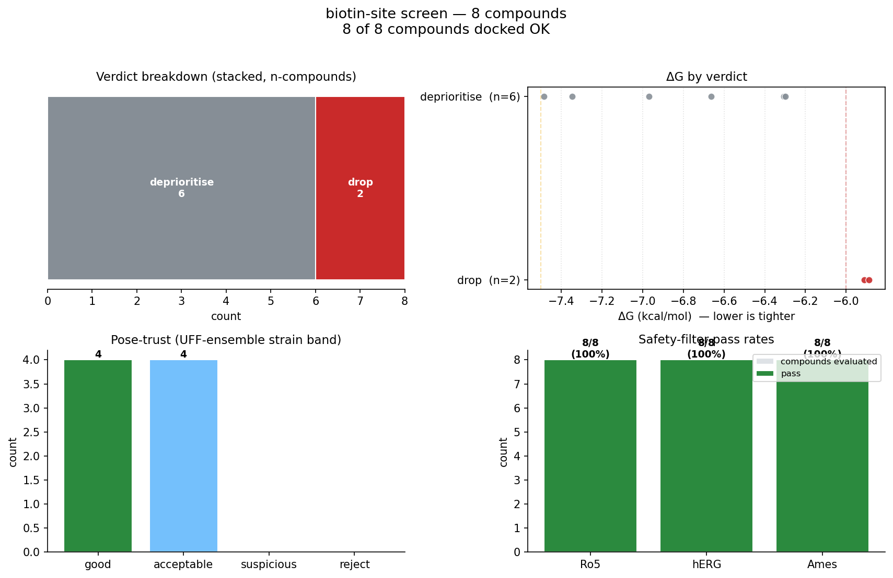

# CellSim — Biologist Tutorial

End-to-end in ~10 minutes: install, run a screen, inspect a hit,
ship a shortlist.

No ML, no black boxes. Every number in every output has a physics
derivation or a cited empirical formula — see [`MISSION.md`](MISSION.md).

## 1. Install (one-time)

CellSim ships a single conda environment covering everything from
RDKit to xTB to Vina to PoseBusters.

```bash
# Install mambaforge first if you don't have conda.
# (macOS:    brew install miniforge)
# (Linux:    see https://github.com/conda-forge/miniforge#install)

# From the CellSim repo root:
mamba env create -f environment.yml     # ~5 min
conda activate cellsim
```

The `conda activate cellsim` step sets `AMBERHOME`, which is
required for AM1-BCC partial charges. A bare `python …` invocation
without the activate will silently fail at charge assignment — see
[`src/chem/README.md`](src/chem/README.md) for diagnostics.

Everything below assumes `conda activate cellsim` has been run.

## 2. First screen on a bundled cocrystal (3 min)

CellSim ships the streptavidin–biotin cocrystal (PDB 1STP) and a
tiny 5-compound validation batch (biotin + 4 non-binder drugs). Run
a full screen:

```bash
./scripts/cellsim dock \
    --smi benchmarks/dock/1stp_batch_5.smi \
    --receptor benchmarks/dock/1stp.pdb \
    --out-csv /tmp/run/report.csv \
    --mc 4 --profile-top-k 3 \
    --crystal-pdb benchmarks/dock/1stp.pdb --crystal-resname BTN
```

What happens:

1. **Pocket detection.** If you hadn't given `--center`/`--box`,
   fpocket would auto-find the binding site. (Here we skip because
   we *do* know the site from the crystal.)
2. **Per-compound**: RDKit embed → OpenFF Sage parameters → AM1-BCC
   charges → Vina docks 4 seeds for the `--mc 4` Monte-Carlo.
3. **PoseBusters** grades pocket fit + geometry per pose.
4. **ADMET**: Lipinski / QED / logS / TPSA computed alongside.
5. Ranks, writes `/tmp/run/report.csv`, then generates
   `/tmp/run/profile_01_biotin_TRUE_BINDER.png` (and top 2 + 3).

Expected stdout:

```
RANK  NAME                     TRIAGE         ΔG(kcal)   K_d        POCKET  STRAIN       Ro5  QED   logS
   1  biotin_TRUE_BINDER       follow_up         -7.45    3.5 µM    ✓       acceptable  ✓    0.49  -1.53
   2  ibuprofen_negative       deprioritise      -7.36    4.1 µM    ?       good        ✓    0.82  -3.09
   3  aspirin_negative         drop              -6.66   13.0 µM    ✓       acceptable  ✓    0.55  -1.99
```

To produce a hand-to-wet-lab shortlist containing only compounds
worth chemists' time (`follow_up` + `review` verdicts), add
`--shortlist-csv`:

```bash
./scripts/cellsim dock ... --out-csv run/full.csv \
                            --shortlist-csv run/shortlist.csv
```

The shortlist has the same columns as the full CSV but filters
out `deprioritise` and `drop` rows, so you can paste it straight
into a wet-lab handoff meeting.

Whenever `cellsim dock` writes a CSV via `--out-csv`, it also
writes a `<name>.triage.png` next to it — the 4-panel dashboard
below appears automatically, no extra command needed. To
regenerate from an existing CSV:

```bash
./scripts/cellsim triage-png run/report.csv --out run/triage.png
```

Panels: stacked verdict bar, ΔG scatter faceted by verdict,
pose-trust (strain band) counts, and safety-filter pass rates
(Ro5 / hERG / Ames). Paste-into-meeting ready.



The `TRIAGE` column is the one-decision column for wet-lab
handoff. Four verdicts:

| verdict | what to do |
|---|---|
| `follow_up` | strong ΔG, trustworthy pose, ADMET clean — synthesise |
| `review` | strong ΔG but one flag (strain / pocket / hERG / Ames) needs a chemist's eye |
| `deprioritise` | borderline ΔG or a flag on a borderline hit — skip unless scaffold-important |
| `drop` | too weak (ΔG > −6), non-physical pose, ≥3 Ro5 violations, or high-risk Ames |

The CSV carries a `triage_reason` column with a paste-ready
string (`"ΔG -7.23 borderline"`, `"suspicious pose strain; hERG
alert"`). Biologist reads one column, not five booleans.

The `STRAIN` column bands the UFF-ensemble strain ratio of the
top pose (Buttenschoen 2024 Chem Sci 15:3130): `good` / `acceptable`
/ `suspicious` / `reject`. A `reject` here force-drops the
compound regardless of ΔG because the pose isn't physical.

## 3. Reading a drug-profile PNG

Open `/tmp/run/profile_01_biotin_TRUE_BINDER.png` and you'll see
six panels on one page:

| Panel | What it tells you |
|---|---|
| **3D + charges** (top-left) | Atom positions with Mulliken charges (blue = electron-rich, red = electron-poor). Spot the nucleophiles / electrophiles by eye. |
| **SoM prediction** (top-mid) | Red atom = predicted primary CYP3A4 metabolism site. Orange = top-3. Tells you where metabolism will clear this drug. |
| **Text datasheet** (top-right) | Full ADMET + electronic summary. Your compound's MW, logP, HBA/HBD, rotb, QED, HOMO/LUMO. |
| **HOMO/LUMO bar** (bottom-left) | Electronic gap → reactivity/stability cue. |
| **BDE chart** (bottom-mid) | Top-10 bonds by dissociation energy. Low BDE = easier to abstract = CYP hotspot. |
| **Ro5 / QED callouts** (bottom-right) | Big green/red "is this drug-like?" glance. |

One page → one compound triage decision.

## 4. Run on your own target + compound list

Drop a receptor PDB and a SMILES file into the repo:

```bash
cat > /tmp/my_compounds.smi <<'EOF'
CC(=O)OC1=CC=CC=C1C(=O)O	aspirin
CC(C)CC1=CC=C(C=C1)C(C)C(=O)O	ibuprofen
Oc1ccc(/C=C/C(=O)O)cc1	p-coumaric_acid
EOF

./scripts/cellsim dock \
    --smi /tmp/my_compounds.smi \
    --receptor path/to/your_target.pdb \
    --out-csv /tmp/my_screen/report.csv \
    --mc 8 --profile-top-k 10 \
    --refine-poses
```

No `--center`? fpocket auto-detects the binding site from receptor
geometry.

`--mc 8` runs 8 Vina seeds per compound → honest ΔG mean ± 95% CI
in the CSV.

`--refine-poses` runs OpenMM ligand-only minimisation on each pose
→ PoseBusters `geometry_ok` flag is meaningful downstream.

`--profile-top-k 10` auto-generates the per-compound dashboard
PNGs for your top 10 hits.

### Caching repeat screens

Add `--cache /tmp/my_screen/cache.sqlite` (or any path) to store the
expensive Vina and AM1-BCC results content-addressed by the
(ligand, receptor, search box, exhaustiveness, seed) tuple. The
second run of an identical batch reads every compound from cache
instead of recomputing — **~1000× per-compound Vina speedup, ~19×
end-to-end on a small screen** (larger wins on bigger libraries).

Safe to delete the SQLite file any time to invalidate; automatic
on force-field bumps since the FF version is baked into the cache
key.

### Exporting poses for PyMOL / ChimeraX

Add `--export-poses-dir DIR` and CellSim writes `DIR/<compound>.sdf`
(RDKit V2000 with ΔG / K_d / crystal-RMSD / pocket_ok as SDF
properties) and `DIR/<compound>.pdb` (MODEL-separated with REMARK
annotations) for every successfully docked compound:

```bash
cellsim dock --smi compounds.smi --receptor target.pdb \
    --export-poses-dir run/poses --out-csv run/report.csv
```

Then in PyMOL: `File → Open → run/poses/top_hit.sdf`.

### CYP3A4 metabolism site-of-metabolism (SoM)

The CYP SoM predictor tells a biologist where a drug is likely to
get oxidised in the liver, which is a direct proxy for its half-
life and clearance. xTB BDE picks the reactive site in ~s per
compound; for high-stakes calls, DFT B3LYP/def2-SVP rescoring
flips the ranking when xTB disagrees:

```bash
cellsim som "CC(=O)OC1=CC=CC=C1C(=O)O"                     # xTB only, <1 s
cellsim som "CC(=O)OC1=CC=CC=C1C(=O)O" --dft-verify 3      # +DFT, ~60 s
cellsim som-validate benchmarks/quantum/cyp3a4_som_validation.yaml \
    --dft-verify 3   # compares top-1 against literature sites
```

See `benchmarks/quantum/cyp3a4_som_validation.yaml` for a
literature-cited 3-drug validation set; the SMARTS in
`known_som_smarts` encodes the experimentally reported primary
metabolism site per compound.

### Off-target selectivity screen

One compound vs many receptors — in-silico off-target toxicity
triage. CellSim auto-detects each receptor's binding site via
fpocket and reports a ΔG per target plus the selectivity ΔΔG
between the intended target and the strongest off-target:

```bash
cellsim off-target \
    --ligand-smiles "OC(=O)CCCC[C@@H]1SC[C@@H]2NC(=O)N[C@H]12" \
    --receptors "streptavidin=1stp.pdb,trypsin=3ptb.pdb,EGFR=1m17.pdb" \
    --cache offtarget.sqlite \
    --out-csv offtarget.csv
```

Reads "biotin binds streptavidin at −7.4 kcal/mol, everything else
is weaker, selectivity margin is 1.4 kcal/mol". The convention in
pharma is ΔΔG ≥ 3 kcal/mol = "good selectivity" (~200× K_d gap).

## 5. Single-compound tools

Want just the ADMET for one SMILES?

```bash
./scripts/cellsim admet "CC(=O)OC1=CC=CC=C1C(=O)O"
# [OK] ADMET C9H8O4 MW=180.2 logP=+1.31 TPSA=63.6 HBA=3 HBD=1
#      rotb=2 Ro5 ✓ QED=0.55 logS=-1.99 (soluble)
```

xTB electronic structure?

```bash
./scripts/cellsim xtb "CC(=O)OC1=CC=CC=C1C(=O)O"
# [OK] xtb GFN2-xTB … HOMO=-11.38 LUMO=-7.87 gap=3.51 eV µ=2.39 D
```

CYP3A4 site-of-metabolism?

```bash
./scripts/cellsim som "CC12CCC3C(C1CCC2=O)CCC4=CC(=O)CCC34C"
# [OK] SoM CYP3A4 testosterone … 26 candidates
#   rank= 1  C(idx=5)  BDE= 118.7 kcal/mol
#   rank= 2  C(idx=4)  BDE= 120.6 kcal/mol
#   rank= 3  C(idx=12) BDE= 123.9 kcal/mol
```

Full drug profile PNG in one shot:

```bash
./scripts/cellsim profile testosterone \
    --smiles "CC12CCC3C(C1CCC2=O)CCC4=CC(=O)CCC34C" \
    --save testosterone.png
```

## 6. Uncertainty quantification tools

Monte-Carlo ΔG estimate for one compound against one target:

```bash
./scripts/cellsim uq-mc \
    --receptor benchmarks/dock/1stp.pdb \
    --ligand-smiles "OC(=O)CCCC[C@@H]1SC[C@@H]2NC(=O)N[C@H]12" \
    --center 11.12,1.68,-10.75 --box 20,20,20 \
    --n 16 --workers 4
# ΔG = -7.42 ± 0.03 kcal/mol  95 % CI [-7.45, -7.38]
```

Sobol sensitivity — which Vina knob moves ΔG most?

```bash
./scripts/cellsim uq-sobol \
    --receptor benchmarks/dock/1stp.pdb \
    --ligand-smiles "OC(=O)CCCC[C@@H]1SC[C@@H]2NC(=O)N[C@H]12" \
    --center 11.12,1.68,-10.75 --box 20,20,20 \
    --n-base 32 --workers 8
# Reports S1 / ST + 95% CI per input over 256 runs.
```

## 7. What the CSV columns mean

| Column | Meaning |
|---|---|
| `rank` | Rank within successful compounds (best ΔG = 1). |
| `triage` | Synthesised verdict: `follow_up` / `review` / `deprioritise` / `drop`. One decision column for wet-lab handoff. |
| `triage_reason` | Paste-ready explanation (e.g. "ΔG -7.23 borderline", "high mutagenicity (Ames SMARTS hit)"). |
| `dG_kcalmol` | Vina top-pose ΔG, kcal/mol. More negative = tighter. |
| `dG_kJmol` | Same in SI. |
| `Kd_nM` | Implied K_d = exp(ΔG / RT). |
| `Kd_human` | Auto-formatted ("3.5 µM", "12 nM", …). |
| `dG_mean_kcalmol` | (if `--mc N`) MC mean ΔG over N seeds. |
| `dG_std_kcalmol` | MC standard deviation. |
| `dG_ci95_lo` / `dG_ci95_hi` | 95 % CI from sample percentiles. |
| `crystal_rmsd_A` | (if `--crystal-*`) top-pose RMSD vs crystal HETATM ligand in Å. |
| `pocket_ok` | PoseBusters: pose placed in pocket, no protein clashes. Triage signal. |
| `geometry_ok` | PoseBusters: bonds/angles/chirality all sane. Required for FEP. |
| `pb_all_ok` | All PoseBusters tests pass including RMSD ≤ 2 Å. |
| `strain_band` | UFF-ensemble strain ratio band (good / acceptable / suspicious / reject) — Buttenschoen 2024 Chem Sci. |
| `strain_kcalmol` | Absolute strain energy = E(bound) − E(relaxed) for the docked top pose. |
| `strain_ratio` | E(bound) / E(ensemble_avg). Ratio > 7 means the pose is almost certainly non-physical. |
| `MW`, `logP`, `TPSA`, `HBA`, `HBD`, `rotb` | Lipinski Ro5 inputs + PSA. |
| `ro5_pass` / `ro5_violations` | Rule-of-five flag. |
| `QED` | Bickerton 2012 drug-likeness score in [0,1]. |
| `logS` | ESOL log solubility (mol/L). Higher = more soluble. |
| `solubility` | Qualitative bucket (highly / moderately / slightly / insoluble). |

## 8. When CellSim works well, and when it fails

CellSim replaces the *triage* stage of wet-lab pharma work, not
the *confirmation* stage. Match your target to the table below
before trusting a ΔG / hit-list.

### Targets where the Vina layer is reliable for *ranking*

| Target class | Evidence | Typical accuracy |
|---|---|---|
| Biotin-binding sites (streptavidin, avidin) | [`benchmarks/dock/streptavidin_calibration.yaml`](benchmarks/dock/streptavidin_calibration.yaml) | Spearman +0.80 across 14 orders of magnitude |
| Serine proteases (trypsin, thrombin-like S1 pocket) | [`benchmarks/dock/trypsin_calibration.yaml`](benchmarks/dock/trypsin_calibration.yaml) | MAE 0.9 kcal/mol on the absolute scale |
| Rigid pocket, wide K_d spread (nM → mM) | generalisable from the above | Pearson > 0.6 typical |

### Targets where the Vina layer is *only a pose filter, not a ranker*

| Target class | Evidence | What to do instead |
|---|---|---|
| Kinase ATP sites (EGFR, Abl, CDK, …) | [`benchmarks/dock/egfr_calibration.yaml`](benchmarks/dock/egfr_calibration.yaml) — Spearman −0.49 on 6 EGFR inhibitors | Use Vina for pose/pocket-fit sanity only; rescore with FEP (Layer 1.3 perses integration — pending) |
| Anything where the strain ratio > 3 on top pose | `strain_band = suspicious` / `reject` in the batch CSV | Don't trust the ΔG; strain means Vina contorted the ligand |
| Compounds with > 15 rotatable bonds | Vina's degrees-of-freedom scaling | Flag for refinement (`--refine-poses` + MD rescoring) |
| Metal-coordinating inhibitors (imidazole/pyridine on Zn/Fe targets) | Vina has no metal term | Use our pocket-geometric post-filter (cf. ketoconazole in `cyp-inhibit`); raw ΔG is under-scored |

### Targets CellSim currently cannot replace wet-lab for at all

- **Protein-protein interactions / allosteric sites** — Vina was
  trained on small-molecule ATP-competitive binding; shallow
  protein-protein interfaces give meaningless ΔG.
- **Covalent inhibitors** — no covalent-bond scoring in this
  stack. Meeko prep will silently strip the warhead.
- **Membrane-embedded receptors** (GPCRs, ion channels) — Layer
  1.5 (Martini 3 bilayer) is scaffold-only.

### The `triage` column does the routing for you

For every compound, the batch CSV's `triage` verdict already
bakes these rules in:

- a pose with `strain_band = reject` is automatically marked
  `drop` regardless of ΔG;
- a `suspicious` strain on a strong ΔG routes to `review`;
- kinase ranking failure isn't auto-detected yet (no public
  target-family labels), so for kinase hit-lists, **treat the
  `triage` column as pose-trust only** and re-rank by external
  orthogonal evidence.

## 9. How to trust the output

Every prediction carries provenance. Every CellSim release runs
the full smoke gate in CI — see
[`.github/workflows/smoke.yml`](.github/workflows/smoke.yml) and
the "Validation that runs on every PR" section of
[`README.md`](README.md). On every PR:

- Layer 1.1 chem smoke (10 canonical drugs end-to-end).
- Layer 1.2 short MD on aspirin + 1UBQ.
- Layer 1.3 re-dock gate on 1STP biotin; 3-cocrystal mini-bench.
- Layer 1.4 xTB + SoM smoke.
- Layer 1.6 MC-dock smoke.

A regression on any of the ~11 smoke gates blocks merge.

## 10. What CellSim doesn't do

- **No Campaign-2 cellular biology.** The Layer-2 pathway
  simulation (HeLa p53/MDM2/cisplatin etc.) lives under
  [`OLD/`](OLD/) as a frozen pre-restart snapshot. Campaign 2
  resumes once Campaign 1 closes (see [`ROADMAP.md`](ROADMAP.md)).
- **No ML predictions.** If you want a neural scorer, use a
  different tool; CellSim is deliberately physics-only (see
  [`MISSION.md`](MISSION.md) §"No black-box / no AI surrogates").
- **No rigorous binding affinity for the top hit**. Vina ΔG is
  triage-grade. For publication-grade ΔΔG, bolt a perses FEP run
  onto the refined poses (Layer 1.3 perses hook pending).
- **No membrane proteins yet.** GPCRs / ion channels in a bilayer
  need Layer 1.5 Martini 3, scaffold-only at the moment.

## 11. Getting help

- `./scripts/cellsim help` — subcommand index.
- `./scripts/cellsim <subcommand> --help` — per-subcommand args.
- [`MISSION.md`](MISSION.md) — discipline + non-AI ground rules.
- [`ROADMAP.md`](ROADMAP.md) — Campaign-1 layer status.
- [`docs/campaign1_scope.md`](docs/campaign1_scope.md) — exit
  criteria for each layer.
- Run into a confusing error? Open an issue with the commit SHA
  (`git rev-parse HEAD`) + the stderr.
